# LWC Assignments – Salesforce Lightning Web Components

This repository contains two Lightning Web Component (LWC) assignments focused on **UI interaction, validation, and user experience in Salesforce**.

---

# Assignment 1: Password Field with Show/Hide and Copy

## Objective

Build a Lightning Web Component that allows users to enter a password, toggle its visibility, and copy the password to the clipboard.

## Features

* Password input field
* Show / Hide password functionality
* Copy password to clipboard
* Success message after copying

---

## Functional Flow

### 1️⃣ Initial State

* Password field is empty
* Password is hidden (`type="password"`)
* Eye icon is visible

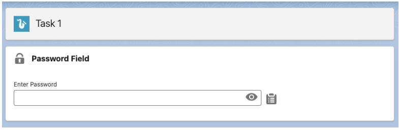

---

### 2️⃣ When User Enters Password

* User types password
* Password remains hidden

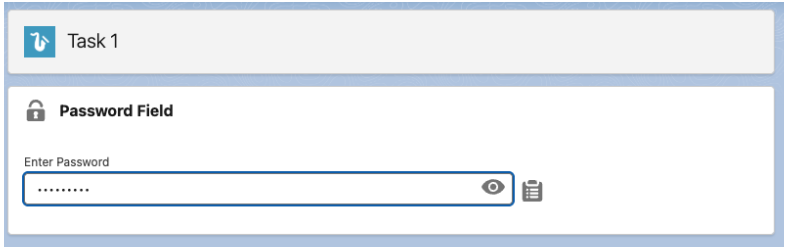

---

### 3️⃣ When Eye Icon is Clicked

* Password becomes visible
* Input type changes from `password` → `text`

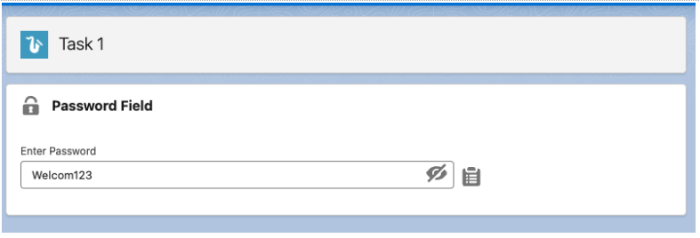

---

### 4️⃣ Copy Password

* Clicking the copy icon copies password to clipboard
* Green success message appears

```
Copied!
```

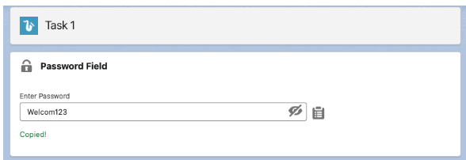

---

## UI Behavior Summary

| Action              | Result                            |
| ------------------- | --------------------------------- |
| User types password | Password stays hidden             |
| Click Eye Icon      | Password becomes visible          |
| Click Eye again     | Password becomes hidden           |
| Click Copy Icon     | Password copied + success message |

---

# Assignment 2: Validated Job Application Form

## Objective

Create a **Job Application Form using Lightning Web Components** with strong **client-side validations**.

---

# Component Details

Component Name

```
jobApplicationForm
```

Available On

* App Pages
* Record Pages

---

# Form Fields and Validations

| Field                | Requirement                                         |
| -------------------- | --------------------------------------------------- |
| Full Name            | Required, minimum 3 characters                      |
| Email                | Required, valid email format                        |
| Phone Number         | Required, exactly 10 digits, cannot start with zero |
| Years of Experience  | Required, number between 0 and 50                   |
| LinkedIn Profile URL | Optional, must start with http or https             |
| Cover Letter         | Required, between 100 and 500 characters            |

---

# Validation Implementation

### Standard Validation

Using Lightning input types

```
lightning-input type="email"
lightning-input type="tel"
lightning-input type="number"
lightning-input type="url"
```

---

### Custom Validation (Phone Number)

Rules

* Must be **10 digits**
* Cannot start with **0**

Using

```
setCustomValidity()
reportValidity()
```

These display validation messages inline.

---

# Submit Button Behavior

When **Submit Application** is clicked:

1. Validate all inputs
2. If validation fails → show inline errors
3. If validation succeeds

   * Show success toast
   * Clear the form

Example message

```
Application submitted successfully!
```

---

# UI Design

* Form wrapped inside

```
<lightning-card>
```

* SLDS classes used

```
slds-p-around_medium
slds-m-bottom_small
```

---

# Screenshots

### Validation Errors

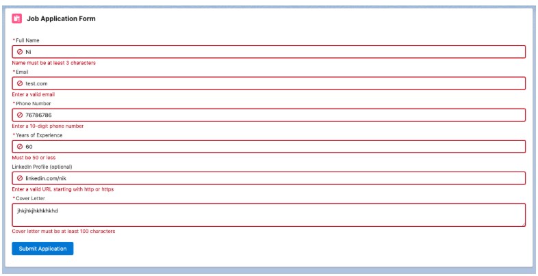

---

### Phone Number Custom Validation

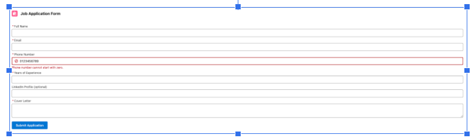

---

### Filled Form State

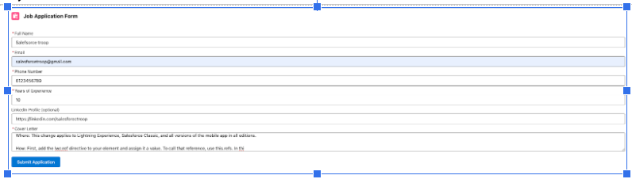

---

### Successful Submission

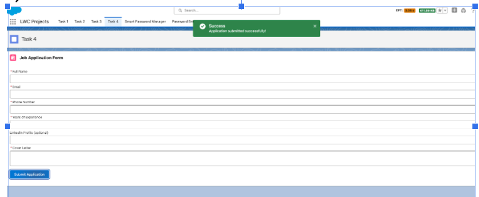

---

# Technologies Used

* Salesforce Lightning Web Components (LWC)
* JavaScript
* HTML
* Salesforce Lightning Design System (SLDS)

---

# Learning Outcomes

After completing these assignments you will understand:

* LWC event handling
* Clipboard API usage
* Dynamic UI updates
* Client-side form validation
* Custom validation with `setCustomValidity`
* Showing feedback using Toast messages
* Clean UI design using SLDS

---
# Assignment 3 – Case Dashboard using LWC and Apex

This project implements a **Case Dashboard in Salesforce** using **Lightning Web Components (LWC)** and **Apex**.
The dashboard provides a modern and visually appealing interface to display **Case statistics and insights**.

It helps users quickly understand the status of cases in the system through **cards, statistics tiles, and tables**.

---

# Objective

Build a **dynamic Case Dashboard** that retrieves case data from Salesforce using **Apex** and displays it in a **clean and responsive UI using Lightning Web Components**.

---

# Key Features

* Display total number of cases
* Show number of **Open and Closed Cases**
* Show **Case Priority distribution**
* Show **Cases opened in the current month**
* Display **Cases grouped by Origin**
* Modern **tile-based dashboard layout**
* Responsive UI for different screen sizes

---

# Apex Controller

The Apex controller retrieves Case-related statistics from Salesforce.

### The controller should return:

* Total number of Cases
* Number of **Open Cases**
* Number of **Closed Cases**
* Count of Cases by **Priority**

  * High
  * Medium
  * Low
* Number of Cases **opened in the current month**
* Count of Cases grouped by **Case Origin**

These values are sent to the LWC using **@AuraEnabled methods**.

---

# Lightning Web Component (LWC)

The LWC component fetches data from the Apex controller and displays it on the dashboard.

### Key LWC Concepts Used

* `@wire` to call Apex methods
* Tracked properties to store returned data
* Dynamic UI rendering using Lightning components

Example usage:

```
@wire(getCaseDashboardData)
casesData;
```

---

# Dashboard Layout

The dashboard is organized using a **3-column tile layout**.

Each statistic appears in its own **card tile**.

### Example Tiles

* Total Cases
* Open Cases
* Closed Cases
* High Priority Cases
* Medium Priority Cases
* Low Priority Cases
* Cases Created This Month

---

# UI Design

The dashboard uses **Lightning Design System (SLDS)** to maintain consistent styling.

### Design Elements

* Tile-based card layout
* Clear spacing and alignment
* Clean typography
* Responsive layout

Example structure:

```
lightning-card
   ├─ Stat Tiles
   ├─ Priority Statistics
   └─ Cases by Origin Table
```

---

# Tile Color Themes

Different colors are applied to make the dashboard visually intuitive.

| Tile            | Color Theme |
| --------------- | ----------- |
| Total Cases     | Purple      |
| Open Cases      | Blue        |
| Closed Cases    | Green       |
| High Priority   | Red         |
| Medium Priority | Orange      |
| Low Priority    | Yellow      |

---

# Cases by Origin Table

Cases grouped by **Origin** are displayed using **Lightning Datatable**.

Example Origins:

* Phone
* Email
* Web
* Chat

### Datatable Features

* Displays Origin name
* Displays Case count
* Clean tabular layout

Example structure:

```
Origin | Case Count
-------------------
Phone  | 25
Email  | 18
Web    | 12
Chat   | 6
```

This table appears inside its own **dashboard tile**.

---

# Responsiveness

The dashboard layout adapts to different screen sizes.

### Large Screens

* Tiles appear in **three columns**
* Table displayed alongside tiles

### Small Screens

* Tiles automatically stack vertically
* Table moves below the tiles

---

# Screenshots

## Large Screen Layout


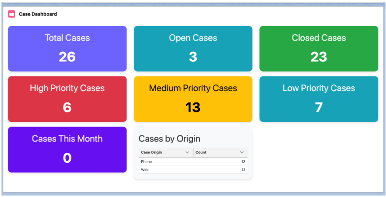


---

## Small Screen Layout


Example:

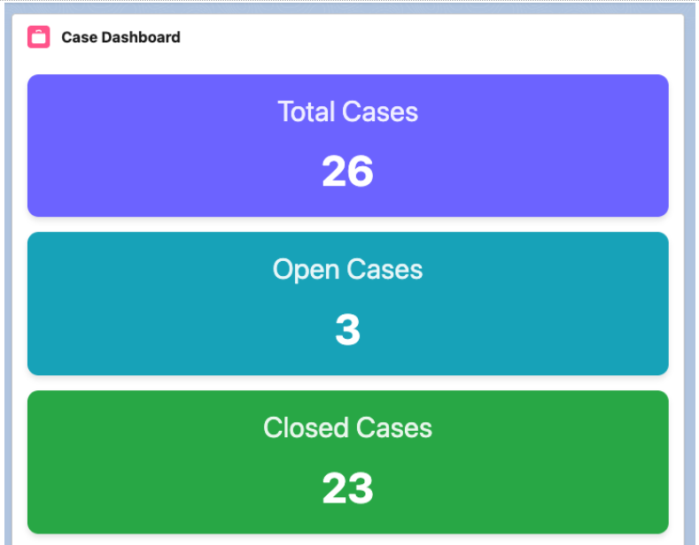


# Technologies Used

* Salesforce Lightning Web Components (LWC)
* Apex
* Lightning Datatable
* Salesforce Lightning Design System (SLDS)

---

# Learning Outcomes

Through this assignment you will learn:

* Integrating **Apex with LWC**
* Using `@wire` to fetch server-side data
* Creating **dashboard-style UI components**
* Using **Lightning Datatable**
* Building **responsive Salesforce UI layouts**
* Applying **SLDS styling and layout utilities**

---

# 📌 FAQ Accordion - LWC Component

## 🚀 Overview

This project is a **Lightning Web Component (LWC)** that displays Frequently Asked Questions in an **accordion format** with interactive toggle functionality.

It allows users to expand/collapse answers and switch between **multiple-open mode** and **single-open mode**.

---

## 🧩 Features

* ✅ Accordion-style FAQ layout
* ✅ Expand/Collapse answers on click
* ✅ Toggle icons (+ / –)
* ✅ Switch between:

  * Multiple FAQs open at once
  * Only one FAQ open at a time
* ✅ Built using **SLDS (Salesforce Lightning Design System)**
* ✅ Responsive and clean UI
* ✅ Wrapped inside a Lightning Card

---

## 🛠️ Component Details

* **Component Name:** `faqAccordion`
* **Exposed To:**

  * App Page
  * Record Page
  * Home Page

---

## 📂 Data Used

* Hardcoded FAQ data
* Minimum **3 questions**
* Each answer contains **~500 characters**

---

## ⚙️ Functionality

### 🔹 Accordion Behavior

* Click on a question → toggles the answer
* Displays:

  * ➕ when collapsed
  * ➖ when expanded

### 🔹 Toggle Mode Switch

A switch is provided to control behavior:

| Mode | Description                              |
| ---- | ---------------------------------------- |
| OFF  | Multiple FAQs can be open simultaneously |
| ON   | Only one FAQ can be open at a time       |

---

## 📸 Screenshots

### 1️⃣ Initial State

All FAQs are collapsed by default.
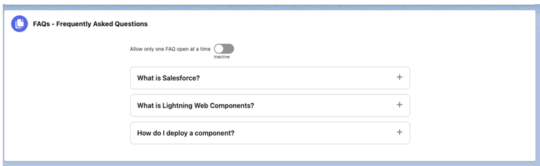

### 2️⃣ Multiple FAQs Open

Users can expand multiple questions at the same time.
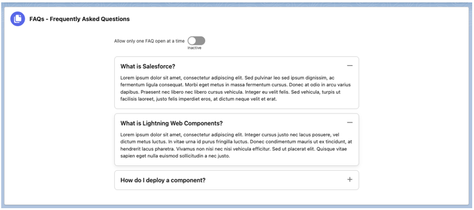

### 3️⃣ Toggle Switch Enabled

Switch turned ON → prepares for single-open mode.
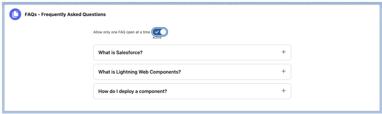

### 4️⃣ Single FAQ Mode

Only one FAQ stays open at a time; others collapse automatically.
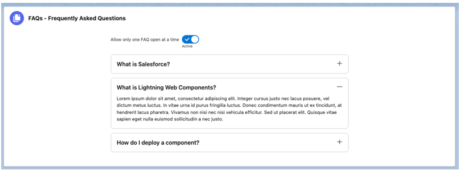

---

## 🎨 UI & Styling

* Uses **SLDS classes** for layout and spacing
* Clean card-based design using `<lightning-card>`
* Icons aligned to the right for better UX
* Smooth user interaction

---

## 📦 How to Use

1. Deploy the component to your Salesforce org
2. Go to **App Builder**
3. Drag and drop `faqAccordion` onto:

   * App Page / Record Page / Home Page
4. Save and Activate

---


# Author

**Koppisetti Charan Sai**
© 2026 koppisetti Charan Sai. All rights reserved.

